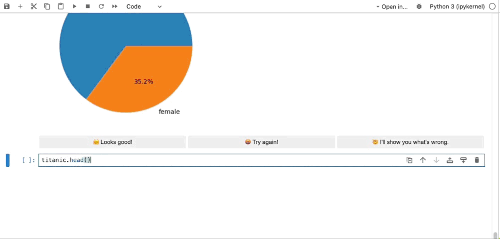
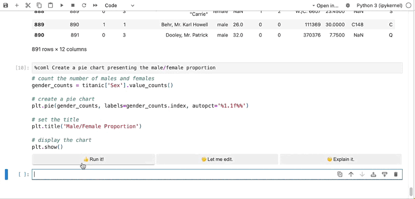
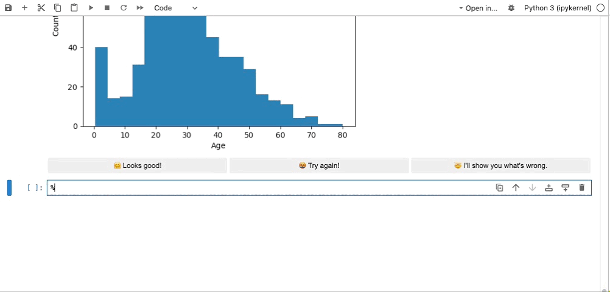

# CoML

CoML (formerly MLCopilot) is an interactive coding assistant for data scientists and machine learning developers, empowered on large language models.

Highlight features:

* Out-of-the-box interactive natural language programming interface for data mining and machine learning tasks.
* Integration with Jupyter lab and Jupyter notebook.
* Built-in large knowledge base of machine learning, enhancing the ability of solving complex tasks.

## Installation

```bash
pip install mlcopilot
```

(We can't have the name `coml` on PyPI, so we use `mlcopilot` instead.)

## CoML in Jupyter Lab

We recommend trying CoML in a Jupyter Lab environment. Before using CoML, please make sure that:

1. You have exported `OPENAI_API_KEY=sk-xxxx` in your environment. Alternatively, you can also use a `.env` file.
2. Use `%load_ext coml` in your notebook to active CoML extension.

Then we have provided several commands to assist your journey with interactive coding in Jupyter Lab.

1. `%coml <task>` to prompt CoML to write a cell for your task.



2. `%comlfix` to fix the cell just above the current cell. You can also use `%comlfix <reason>` to provide details for what's wrong.



3. `%comlinspire` to inspire you with a cell describing what to do next.



**Limitations:**

* Currently, CoML only supports Jupyter Lab and classical Jupyter notebook (nbclassic). We are still working on supports of newer Jupyter notebook, Jupyter-vscode and Google Colab.
* CoML uses gpt-3.5-turbo-16k model in its implementation. There is no way to change the model for now. The cost of using this model is around $0.04 per request. Please be aware of this cost.

## CoML Config Agent

CoML config agent is the implementation of [MLCopilot]((https://arxiv.org/abs/2304.14979)), which can suggest a ML configuration within a specific task, for a specific task. Currently, it is an independent component residing in `coml.configagent`. In the future, we will integrate it into the CoML system.


(TODO: The demo needs an update.)

#### Extra preparation steps

Please follow the steps to use CoML config agent:

1. Clone this repo: `git clone REPO_URL; cd coml`
2. Put assets/coml.db in your home directory: `cp assets/coml.db ~/.coml/coml.db`
3. Copy `coml/.env.template` to `~/.coml/.env` and put your API keys in the file.

#### Command line utility

Currently, it can only be invoked independently. You can use the following command line:

```
coml-configagent --space <space> --task <task>
```

If you feel uncertain about what to put into `<space>` or `<task>`, see the demo above, or try the interactive usage below:

```
coml-configagent --interactive
```

#### API Usage

```python
from coml.configagent.suggest import suggest

space = import_space("YOUR_SPACE_ID")
task_desc = "YOUR_TASK_DESCRIPTION_FOR_NEW_TASK"
suggest_configs, knowledge = suggest(space, task_desc)
```

## Development

Development documentation stays here for now. It shall be moved to a separate document later.

### Project structure

Important files and folders:

```
CoML
├── assets          # data, examples, demos
├── coml            # Python package
├── examples        # example scripts
├── install.json    # Jupyter lab extension installation file
├── package.json    # Jupyter lab extension package file
├── pyproject.toml  # Python package configuration
├── src             # Jupyter lab extension source code
├── test            # Python package tests
└── tsconfig.json   # Jupyter lab extension TypeScript configuration
```

### Installation and uninstallation

You can use the following command for development installation:

```
pip install -e .[dev]
```

If you are to develop Jupyter lab extension, you will also need to install NodeJS and npm, and run the following command:

```
# Link your development version of the extension with JupyterLab
jupyter labextension develop . --overwrite
# Rebuild extension Typescript source after making changes
jlpm run build
```

To uninstall, you can run the following commands:

```bash
# Server extension must be manually disabled in develop mode
jupyter server extension disable coml

# Uninstall the Python package
pip uninstall mlcopilot
```

In development mode, you will also need to remove the symlink created by `jupyter labextension develop` command.
To find its location, you can run `jupyter labextension list` to figure out where the `labextensions` folder is located.
Then you can remove the symlink named `coml` within that folder.

### Packaging

```bash
hatch build
```

## Citation

If you find this work useful, please cite the paper as below:

    @article{zhang2023mlcopilot,
        title={MLCopilot: Unleashing the Power of Large Language Models in Solving Machine Learning Tasks},
        author={Zhang, Lei and Zhang, Yuge and Ren, Kan and Li, Dongsheng and Yang, Yuqing},
        journal={arXiv preprint arXiv:2304.14979},
        year={2023}
    }

## License

The entire codebase is under [MIT license](LICENSE).
